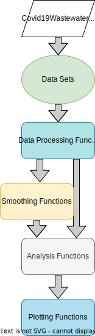

<p align="center">
	<div align="center">
		
	</div>
</p>

# AFIDSI Wastewater Analysis Package


[](https://github.com/AFIDSI/DSIWastewater/pulls)
[](./LICENSE.md)
[](https://github.com/AFIDSI/DSIWastewater/graphs/contributors)
 
 
This is an R package of utilities to perform wastewater data analysis for pathogenic surveillance and monitoring. 

This project is a collaboration between the University of Wiscosin's Data Science Institute (DSI), the Wisconsin Department of Health Services (DHS), and the State Lab of Hygiene (SLH).

DSI:
- <https://datascience.wisc.edu>

DHS:
- <https://www.dhs.wisconsin.gov>
- <https://www.dhs.wisconsin.gov/covid-19/wastewater.htm>

SLH:
- <http://www.slh.wisc.edu/environmental/covid-19-wastewater/>


## Repository Sections
There are three parts of the package; Data, Data Prep, Analysis tools.

### Data
This package includes [Traditional and Wastewater based data](data/README.md) about Wisconsin communities.

### Data Preparation
This includes functions to create calculated columns, smoothings and filtering.

### Analysis Tools
This includes tools to generate DHS flags for both case and wastewater data. It also includes tools to run random linear forests.

## Package Application 

- We applied this package to Covid-19 data from Wisconsin in our analysis repository [here.](https://github.com/AFIDSI/Covid19-Wastewater-Analysis)

## Installation

If you already have devtools installed you can install the package with
```
devtools::install_github("AFIDSI/DSIWastewater")
```
Otherwise we have comprehensive instructions [here](./docs/Install.md).

## Documentation

- View the [API Reference](./docs/api/api.md).

<p>
    <div align="center">
        
        <div>
            <label>API Architecture Overview</label>
        </div>
    </div>
    <br />
</p>
 
- View the package vignettes with:

```
vignette(package = "DSIWastewater")
```

- Look at all package functionality with:

```
help(package = "DSIWastewater")
```
 

<!-- LICENSE -->
## License

Distributed under the Sustainable Use License. See the [license](./LICENSE.md) for more information.

<!-- Contact -->
## Team
Email:
- Marlin Lee - (mailto:mrlee6@wisc.edu)

- Abe Megahed - (mailto:amegahed@wisc.edu)

- Kyllan Wunder - (mailto:kwunder@wisc.edu)

Repos:
- Package Link: [https://github.com/AFIDSI/DSIWastewater](https://github.com/AFIDSI/DSIWastewater)

- Analysis Link: [https://github.com/AFIDSI/Covid19-Wastewater-Analysis](https://github.com/AFIDSI/Covid19-Wastewater-Analysis)
