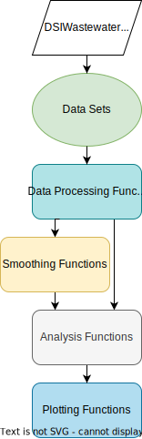

<p align="center">
	<div align="center">
		
	</div>
</p>

# AFIDSI Wastewater Analysis Package
 
This is an R package of utilities to perform wastewater data analysis for pathogenic surveillance and monitoring. 

This project is a collaboration between the University of Wiscosin's Data Science Institute (DSI), the Wisconsin Department of Health Services (DHS), and the State Lab of Hygiene (SLH).

DSI:
- <https://datascience.wisc.edu>

DHS:
- <https://www.dhs.wisconsin.gov>
- <https://www.dhs.wisconsin.gov/covid-19/wastewater.htm>

SLH:
- <http://www.slh.wisc.edu/environmental/covid-19-wastewater/>

## Continuous results

- View our analysis repo [here](https://github.com/AFIDSI/Covid19-Wastewater-Analysis)

## Installation
There are two ways to install the AFIDSI Wastewater Analysis package:

### 1. Using Devtools

If you do not have the [Devtools](https://www.r-project.org/nosvn/pandoc/devtools.html) R package install it by run this command:

```
install.packages("devtools")
```

Once Devtools is installed anyone can install the package by running the command:

```
devtools::install_github("AFIDSI/DSIWastewater")
```

When running this command, you will be prompted to select which packages you want updated/installed.  We strongly suggest you select '1: ALL' so that you don't need to install any dependencies later.  

To install the dependencies later, you can run the following command:

```
devtools::install_dev_deps(pkg = "DSIWastewater")
```

If you would ever like to recive an update of our package simply remove the package using this command:

```
remove.packages("DSIWastewater")
```

Then reinstall the package using the above commands.


### 2. Using a TAR (.tgz) file

You can also install the package using a tar file.

1. Download the tar file

You can download the AFIDSI wastewater package tar file from the following location(in this current repo):
https://github.com/AFIDSI/DSIWastewater/blob/main/DSIWastewater_0.5.1.tar.gz

---
**Tip:** 
When you download it, make sure that it remains zipped.  It should be a .tar.gz file rather than a .tar file.   If the file has been unzipped, then you can re-zip it using the following linux command:

```
gzip DSIWastewater_0.5.1.tar.gz
```

---

2. Install the tar file

To install the tar file, you can use the following command:

```
install.packages("DSIWastewater_0.5.1.tar.gz", repos = NULL, type="source") 
```

Alternatively, if you are using RStudio, you can install the tar file [using the user interface](./docs/r-studio/installing-packages.md).


## Documentation

- View the [API Reference](./docs/api/api.md).

<p>
    <div align="center">
        
        <div>
            <label>API Architecture Overview</label>
        </div>
    </div>
    <br />
</p>
 
- View the package vignettes with:

```
vignette(package = "DSIWastewater")
```

- Look at all package functionality with:

```
help(package = "DSIWastewater")
```
 

<!-- LICENSE -->
## License

Distributed under the Sustainable Use License. See `LICENSE.md` for more information.

<!-- TEAM -->
## Contact
Email:
- Marlin Lee - (mailto:mrlee6@wisc.edu)

- Abe Megahed - (mailto:amegahed@wisc.edu)

- Kyllan Wunder - (mailto:kwunder@wisc.edu)

Repos:
- Package Link: [https://github.com/AFIDSI/DSIWastewater](https://github.com/AFIDSI/DSIWastewater)

- Analysis Link: [https://github.com/AFIDSI/Covid19-Wastewater-Analysis](https://github.com/AFIDSI/Covid19-Wastewater-Analysis)

## Code style
 
- Camel case for functions and file names
 
- Snake case for variables
 
- _data for data objects

- _Plot if the function creates a plot

## Color standards

-  `#0571b0` Major decrease
-  `#92c5de` Moderate decease
-  `#979797` Flucuating
-  `#ffffff` No Change
-  `#f4a582` Moderate increase
-  `#ca0020` Major increase
