<div align="center">
    
</div>

# Getting Started

## Overview

This package is intended to make the process of analyzing epidemiological wastewater data easier and more insightful. It’s intended primarily for researchers and epidemiologists but could potentially be used by anyone with an interest in the topic who has a working knowledge of R programming, epidemiology, and statistics.   

Requirements:
- Knowledge of R programming
- Familiarity with epidemiology
- A base understanding of statistics

This package provides a set of core utilities for preparing your data, analyzing your data, and visualizing the results.  

Features:
- Outlier detection
- Various data smoothing techniques
- Normalization techniques
- Time series analysis
- Wastewater/case offset analysis
- Visualization / graphing tools
- Sample data set courtesy of the Wisconsin Department of Health Services

Note that the package also includes a set of example data.   This was done in order to provide a set of real-world instructive examples which make the code easier to understand and apply to your own data sets.

## What is Wastewater Based Epidemiology?

Epidemiology is the process of investigating and monitoring the prevalence of disease agents within a population or an environment. This has been most commonly performed by collecting case data from hospitals and other public health agencies. Wastewater-based epidemiology takes a different approach by looking for disease agents in the population’s wastewater as it is collected in sewage treatment plants.

## Problems with Traditional Case-Based Epidemiology

During the Covid-19 pandemic, many problems associated with the traditional case-based epidemiology approach became evident.  

- Variations in testing
- Variations in reporting
- Privacy concerns associated with the collection of individual health data
- Disease can take time before onset and presentation in a doctor’s office, so the technique is not very timely.

## The Process of Wastewater-Based Epidemiology
To address these problems, attention has shifted to an alternate/complementary approach - wastewater-based epidemiology.   Wastewater epidemiology is conducted using the following process:

- Wastewater samples are periodically collected from sewer sheds
- Samples are sent to state laboratories for analysis
- Analysis results are communicated to the state health services agencies, where they are compared with reported case rates

<div align="center">
    
    <div>
        <label>The Wastewater Epidemiology Process</label>
    </div>
</div>

## Benefits of Wastewater-Based Epidemiology

The advantages of wastewater-based epidemiology compared with case-based epidemiology are as follows:

- Can provide more timely, almost “real-time” information
- Is well suited for an epidemiological early warning system
- Maintains the anonymity of individuals
- Does not rely upon voluntary testing by individuals so it has the potential to be more consistent.

<div align="center">
    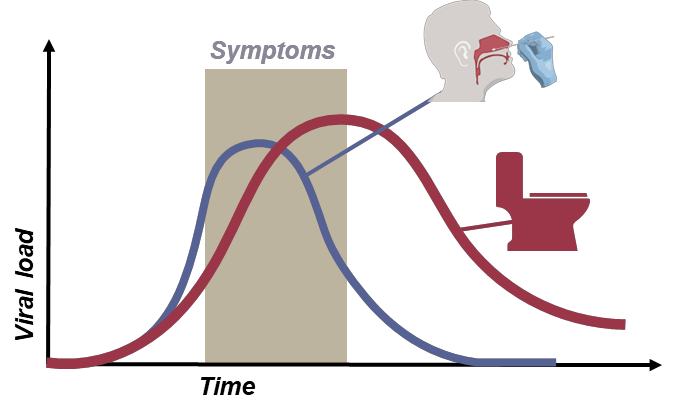
    <div>
        <label>Onset of Symptoms and Wastewater Detection</label>
    </div>
</div>

## Challenges Associated with Wastewater-Based Epidemiology

Despite the very attractive characteristics and promising results of wastewater-based testing, there are also a number of potential challenges associated with this approach which can make it difficult to implement:

- Data is inherently noisy
- There are often significant sampling differences between communities (once per day versus once per week, for example)
- There are often differences in methodology (qpcr versus dpcr etc.)
- There are many cofactors related to wastewater collection and testing which can make interpretation of results difficult.

<div align="center">
    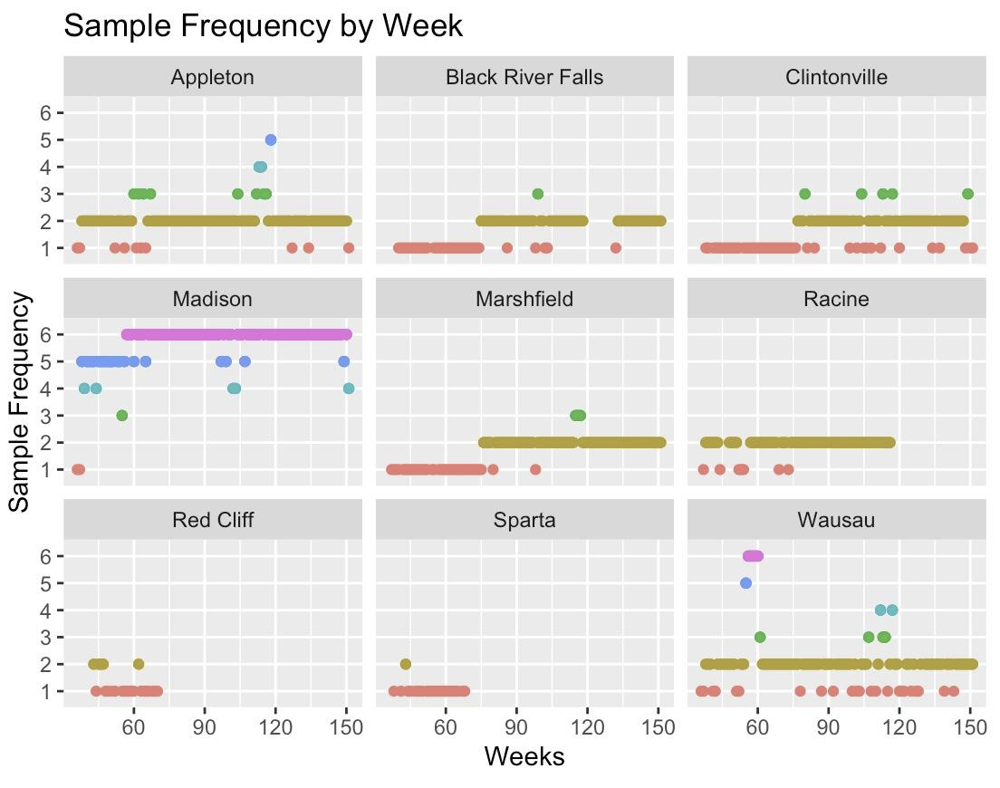
    <div>
        <label>Differences in Sampling Frequency</label>
    </div>
</div>

## The Role of This Software
Because of these various complicating factors and the difficulty in performing wastewater-based analysis and interpreting results, software such as this can serve as a valuable aid in making the analysis and interpretation of this data easier and more reliable. 

# Loading and Viewing Data

The data in this package is a combination of data provided to us from the following sources:
- Wisconsin [Department of Health Services (DHS)](https://www.dhs.wisconsin.gov/covid-19/wastewater.htm)
- Wisconsin [State Lab of Hygiene (SLH)](http://www.slh.wisc.edu/environmental/covid-19-wastewater)
- Open-source data

All data can be found in the /data directory as .RData objects. Alternatively, when our package is installed, these data sets can be loaded by using the command:

```{r}
data(<name here>, package = "Covid19Wastewater")
```

where \<name here\> is replaced with one of the following:

### Data List

- Aux_info_data
Extra data that can be merged with WasteWater_data

- Case_data
Case information for all of Wisconsin from 2020-01-22 to 2022-12-08

- Covariants_data
Statewide variant proportions

- Example_data
A merged and shortened version of Case_data and WasteWater_data from 3 sites

- HFGCase_data
High-frequency data from 6 weeks involving ten sites

- HFGWaste_data
High-frequency data from 6 weeks involving ten sites

- InterceptorCase_data
Madison specific data

- Pop_data
Population data along with region, county, and lab submitter

- WasteWater_data
Wastewater epidemiological data from across Wisconsin can be merged with Aux_info_data

Here is the key to all the column names in the data: https://github.com/UW-Madison-DSI/Covid19Wastewater/blob/main/docs/data/data_columns_discription.md

## Examples

### Viewing Gene Markers Over Time

The prevalence of covid is determined using the genome markers called "N1" and "N2".  A simple starting point is to load in the data and then graph N1 or N2 over time.

```{r}
data("WasteWater_data", package = "Covid19Wastewater")

WasteWater_data %>% ggplot(aes(x=date,y=N1)) +
  geom_point()
```

<div align="center">
    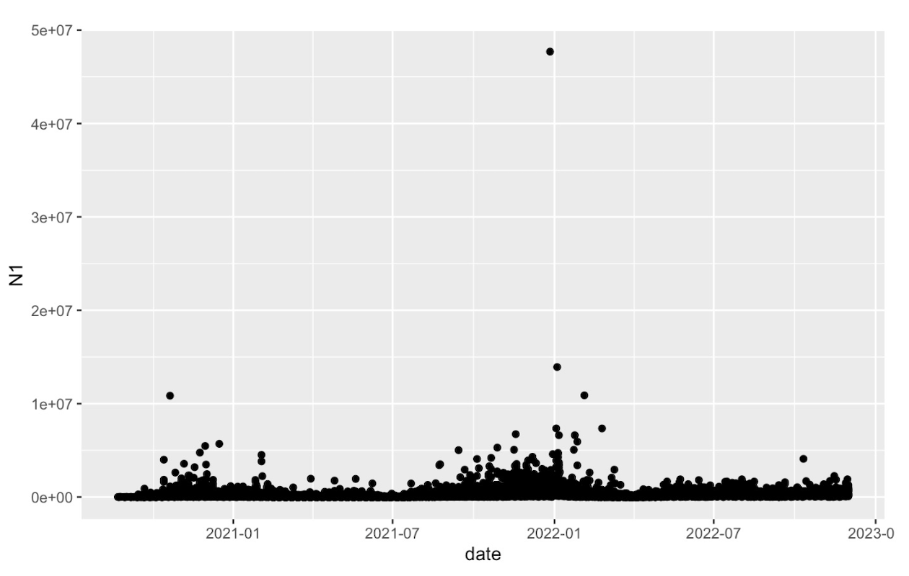
    <div>
        <label>The Levels of Covid Markers N1 and N2 Over Time</label>
    </div>
</div>

### Adding Color

With a few extra lines of code, we can add some color coding in order to display  N1 and N2 in a more visually appealing way.

```{r}
data("WasteWater_data", package = "Covid19Wastewater")

WasteWater_data %>% ggplot() +
  geom_point(aes(x=date,y=N2+1, color = "N2")) + #plus 1 to have a nice log
  geom_point(aes(x=date,y=N1+1, color = "N1")) +
  scale_y_log10() +
  ylab("N1 and N2")
```

<div align="center">
    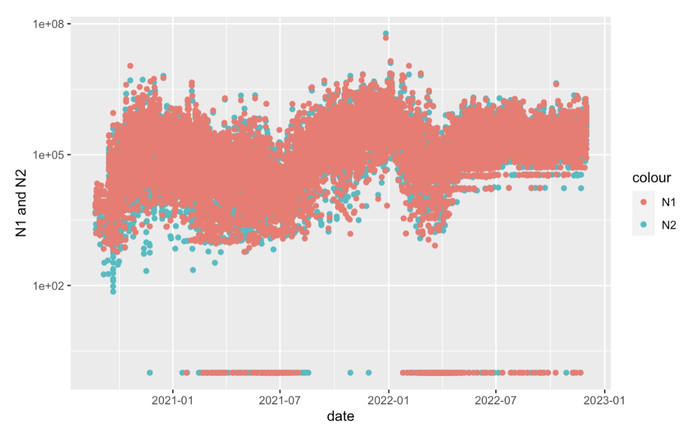
    <div>
        <label>The Levels of Covid Markers N1 and N2 Over Time</label>
    </div>
</div>

## Merging  Datasets

Below, we show a set of examples of merging different datasets.

### 1. Merging Wastewater and Case Data

When merging wastewater and case data, it is best to merge by site and data to identify each entry uniquely.

```{r}
data("WasteWater_data", package = "Covid19Wastewater")
data("Case_data", package = "Covid19Wastewater")

WasteAndCaseMerged_data <- merge(Case_data, WasteWater_data, by = c("site","date"))
head(WasteAndCaseMerged_data)
```

<div align="center">
    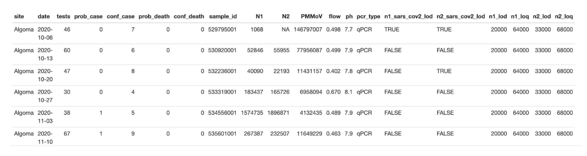
    <div>
        <label>Wastewater and Case Data</label>
    </div>
</div>

### 2.  Merging High-Frequency Wastewater and Case Data

We include high-frequency datasets for both wastewater and case data which can be merged as follows:

```{r}
data("HFGWaste_data", package = "Covid19Wastewater")
data("HFGCase_data", package = "Covid19Wastewater")

HFGWasteAndCaseMerged_data <- merge(HFGCase_data,HFGWaste_data, by = c("site","date"))
head(HFGWasteAndCaseMerged_data)
```

<div align="center">
    
    <div>
        <label>High Frequency Wastewater and Case Data</label>
    </div>
</div>

### 3.  Merging Wastewater and Aux Data

When merging the auxiliary information, it can only be done with sample_id (Aux_info_data can only be merged with WateWater_data)
```{r}
data("WasteWater_data", package = "Covid19Wastewater")
data("Aux_info_data", package = "Covid19Wastewater")

WastewaterAndAuxInfo_data <- merge(WasteWater_data,Aux_info_data, by = "sample_id")
head(WastewaterAndAuxInfo_data)
```

<div align="center">
    
    <div>
        <label>Wastewater and Aux Data</label>
    </div>
</div>

### 4.  Merging Wastewater and Population Data

Population data can be merged with any dataframe that contains site data.

```{r}
data("WasteWater_data", package = "CovidWastewater")
data("pop_data", package = "Covid19Wastewater")
data("Case_data", package = "Covid19Wastewater")

WastewaterAndPop_data <- merge(WasteWater_data, pop_data, by = "site")
head(WastewaterAndPop_data)

CaseAndPop_data <- merge(Case_data, pop_data, by = "site")
head(CaseAndPop_data)
```

<div align="center">
    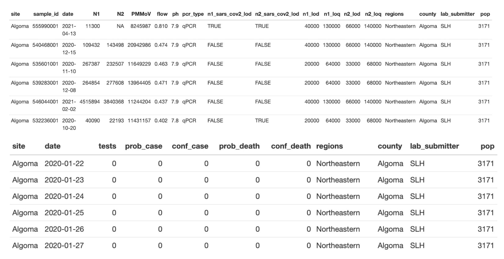
    <div>
        <label>Wastewater and Population Data</label>
    </div>
</div>

### 4.  Merging Wastewater and Confirmed Cases Data
With the data now merged, we can perform many more analyses.  In the analysis below, we show the number of confirmed cases.

```{r}
HFGWasteAndCaseMerged_data %>% 
  ggplot() +
  geom_point(aes(x=log(N1+1),y=log(ConfirmedCases+1),color="N1")) +
  geom_point(aes(x=log(N2+1),y=log(ConfirmedCases+1),color="N2")) +
  facet_wrap("site")
```

<div align="center">
    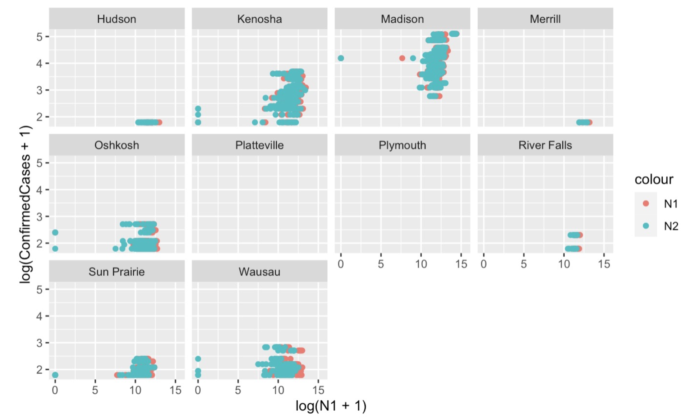
    <div>
        <label>Wastewater and Confirmed Cases</label>
    </div>
</div>

### 4.  Normalizing by Population
Below, we display the number of confirmed cases normalized by population as a function of time.

```{r}
CaseAndPop_data %>% 
    filter(site == "Madison") %>% 
    ggplot(aes(x=date,y=(conf_case/pop)))+
    geom_point()
```

<div align="center">
    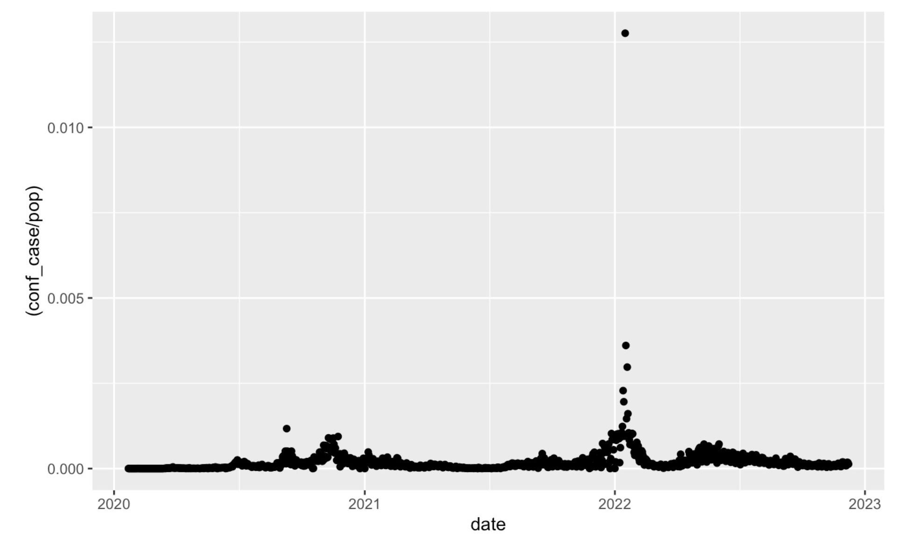
    <div>
        <label>Wastewater and Confirmed Cases / Population</label>
    </div>
</div>

### Tips
Always make sure that when merging, the “by =” should always be able to identify the information you are merging uniquely. (i.e. don't merge waste and case data by date alone)

# Data Preparation


The data preparation takes two main forms:
- Outlier detection and Removal
- Smoothing methods

## Smoothing methods
There are three smoothing methods available to get a more stable  Wastewater measurement.
- loessSmoothMod
- expSmoothMod
- sgolaySmoothMod
Each one can generate a consistent signal from weekly data. A comprehensive Guide on the methods is available [here.](https://github.com/UW-Madison-DSI/Covid19Wastewater/blob/main/docs/vignettes/smoothing.pdf) Below are the smoothing methods applied with their default values to three Citys in the Wastewater dataset.

<div align="center">
    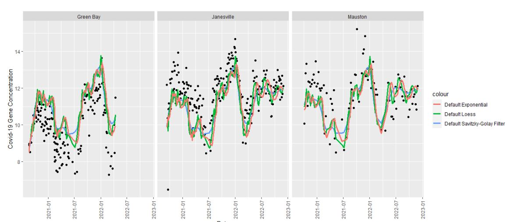
    <div>
        <label>Wastewater and Confirmed Cases / Population</label>
    </div>
</div>


## Outlier detection
There are two main ways to detect outliers in this package.
- Deviance from the trend
- Unusual spikes from adjacent values
Below is a quick description of these methods but a more comprehensive document can be found [here.](https://github.com/UW-Madison-DSI/Covid19Wastewater/blob/main/docs/vignettes/outliers.pdf)

### Deviance from the trend

This process has two steps. First, you need a trend. This can normally be done with the smoothing in the previous section. Then the trend can be used to find points sufficiently greater than it. This is normally set to 2.5 standard deviations. This example of this method with all the default values applied to Janesville. This method has a ton of flexibility and offers the most accuracy when the trend is accurate. The main issue with this method is that it normally will not work on recent data. Most trend methods do not capture the true trend on the edges of the data effects.

```{r}
WasteWater_flag  <- WasteWater_data%>%
    filter(site == "Janesville")%>%
    mutate(N1 = log(N1 + 1))%>%
    select(site, date, N1)%>%
    loessSmoothMod("N1", "N1_loess")%>%
    Flag_From_Trend(N1, N1_loess)

WasteWater_flag %>%
  ggplot(aes(x = date))+
  geom_point(aes(y = N1, color = flagged_outlier))+
geom_line(aes(y = N1_loess, color = "N1 Loess"))+
  theme(plot.title = element_text(hjust = 0.5),
        axis.text.x = element_text(angle = 90, vjust = 0.5, hjust=1))+
  labs(y = "Covid-19 Gene Concentration",
       x = "Date",
       color = "Flagged Outlier"
       )
```

<div align="center">
    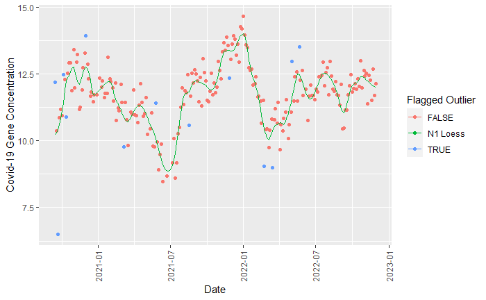
    <div>
        <label>Wastewater and Confirmed Cases / Population</label>
    </div>
</div>


### Unusual spikes from adjacent values

This method involves calculating the difference between two adjacent data points and subsequently assessing the extent to which this difference deviates from the distribution of all other such differences. Focusing on the relative size of the jumps, it requires very little prediction of the trend and future movement. This means it can function with only one extra data point after the measurement. This leads to an answer that can be less precise but captures the worst outliers and is more applicable to long-term trends.
```{r}
WasteWater_data <- WasteWater_data%>%
  select(site, date, N1, N2)%>%
  filter(N1 != 0, N2 != 0)%>%
  mutate(N1 = log(N1), N2 = log(N2), 
    N12_avg = (N1 + N2) / 2)
df_data <- computeJumps(WasteWater_data)
ranked_data <- rankJumps(df_data)
classied_data <- flagOutliers(ranked_quantile_data, 9, MessureRank)%>%
  select(site, date, N12_avg, MessureRank, FlaggedOutlier)

classied_data%>%
  ggplot(aes(x = date))+
  geom_point(aes(y = N12_avg, color = FlaggedOutlier))+
  facet_wrap(~site)+
  theme(plot.title = element_text(hjust = 0.5),
        axis.text.x = element_text(angle = 90, vjust = 0.5, hjust=1))+
  labs(y = "Covid-19 Gene Concentration",
       x = "Date",
       color = "Flagged Outlier"
       )
```
<div align="center">
    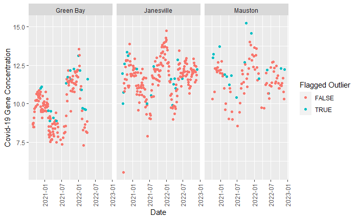
    <div>
        <label>Wastewater and Confirmed Cases / Population</label>
    </div>
</div>


# Data Analysis

## Time Series Analysis
Shedding is an ongoing process from the first day of infection to days or even weeks after symptoms subside. Thus it is hard to know exactly how many individuals in the community are infected at any given time just using wastewater data. Since we have mostly reliable case data, if we can find the offset that best correlates with the 2 data sets, we can work backward from only wastewater data in the future. 

<div align="center">
    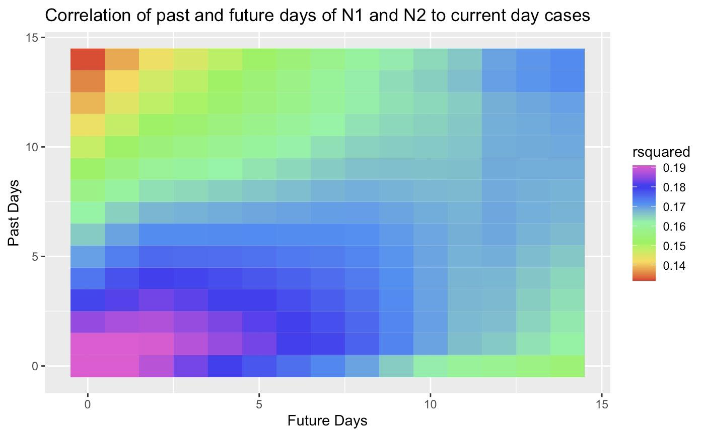
    <div>
        <label>Heatmap of waste to case correlation</label>
    </div>
</div>

This analysis was done by finding the R-squared correlation between the wastewater data of the current day Z and the combined case data from past Y many days and X number of future days. Thus we can find which moving window of days best represents the wastewater data for the next analysis. 

<div align="center">
    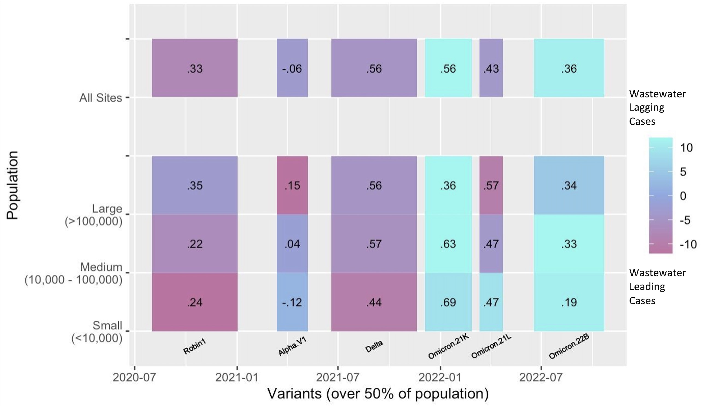
    <div>
        <label>Offset analysis</label>
    </div>
</div>

Using the window of case data days that best correlates to the wastewater data, we can find the offset that best corresponds to the time between shedding at its peak and when the individual got tested. 

View the vignette to learn more here: [Time Series Offset](../vignettes/time_series_offset.pdf)

Or view the vignette in your R interpreter:
```
vignette("time_series_offset", package = "Covid19Wastewater")
```

# Random Linear Forests

We introduce a powerful tool called "random_linear_forest" that offers a unique approach to generating linear relationships between two variables while accounting for the influence of covariates. This innovative method combines the principles of random forests with linear tree modeling, resulting in a versatile and robust framework for understanding the intricate interplay between variables and their covariates. Below is the result of using this model on the Longitudinal data done [here.](https://github.com/UW-Madison-DSI/Covid19-Wastewater-Analysis/blob/main/results/trend_analysis/Random%20Forest/rand_forest_comp.html)

<div align="center">
    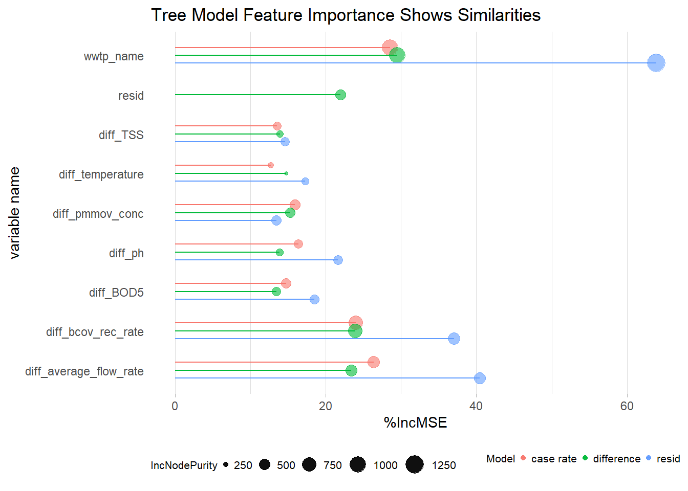
    <div>
        <label>Tree Importance</label>
    </div>
</div>


# Conclusion

We hope you have had a successful and enjoyable experience using this software package.   If you would like to share your results and/or feedback with the package authors, contact information is listed below:

- Marlin Lee - (mailto:mrlee6@wisc.edu)
- Kyllan Wunder - (mailto:kwunder@wisc.edu)
- Abe Megahed - (mailto:amegahed@wisc.edu)
You may also submit comments, feedback, feature requests, and bug reports through the GitHub repository at:  https://github.com/UW-Madison-DSI/Covid19Wastewater

# Acknowledgements

This package was made possible through support from the University of Wisconsin Data Science Institute in collaboration with the Wisconsin Department of Health Services (DHS) and the State Lab of Hygiene (SLH).

