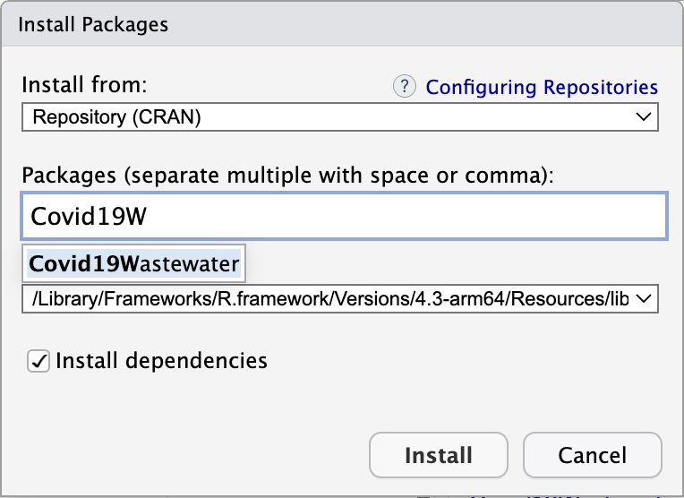

# Installing Packages Using R Studio

To install a package using R Studio, follow these steps:

- Step 1: Under the "Tools" menu, click "Install Packages":

<div align="center">

</div>

- Step 2: On the install package dialog, click under install from and choose the CRAN option. Then start typing "Covid19Wastewater" and select.

<div align="center">

</div>

- Step 3: Click the "Install" button:
  You should see the following command executed in the R Studio console pane:

```
install.packages("Covid19Wastewater")
```

In the console, choose the yes option to install when prompted with questions, such as installing from the source form or any dependent packages.

</p>
</div>

