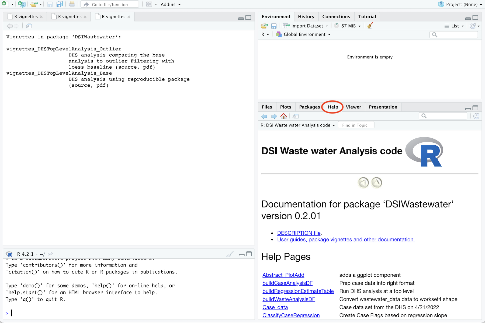
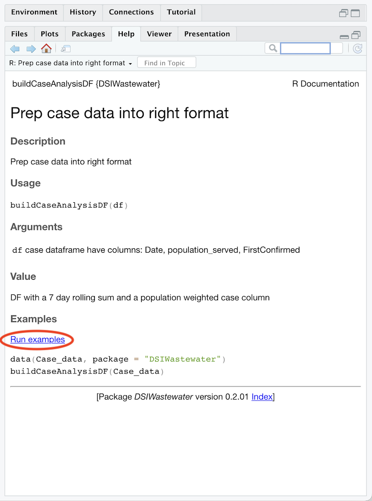
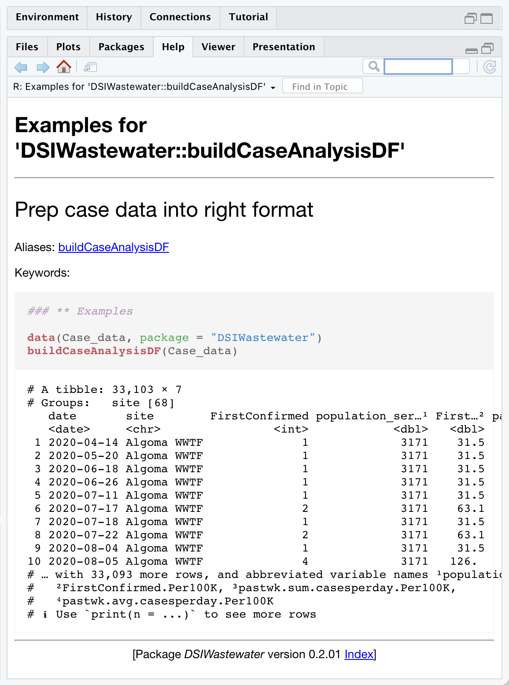

# Viewing The API From Within R Studio

R Studio allows the ability to view documention through the use of "vignettes".  To view the API documentation, first run the vignette by running the following command in the R Studio console:

```
vignette(package = "Covid19Wastewater")
```

Next, to view the API documentation for a particular function, follow these steps:

- Step 1: Locate the help view, which is located under a tab in the lower right pane:
  <div align="center">
    
  </div>

- Step 2: To view the documentation for a particular API method, click on that method in the list:
  <div align="center">
    
  </div>
  
- Step 3: In the API method page, you will see a  method description, arguments and examples, if they are provided.  To view one of the examples, simple click on one of the links in the examples section:
  <div align="center">
    
  </div>

- Step 4: Clicking on an example link will execute and display the results directly in the R Studio help pane:
  <div align="center">
    
  </div>
 